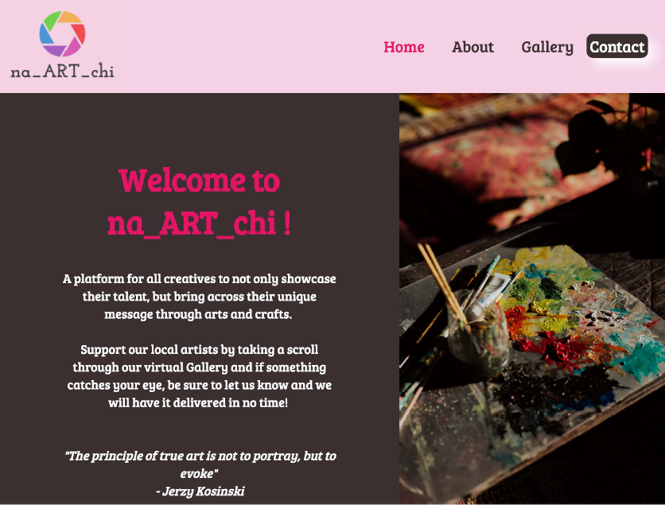

# My-First-Website: na_ART_chi

## Project Description 

This project showcases the integration of HTML, CSS and JavaScript to produce a website for a unique brand named na_ART_chi.

## Screenshot

## Built With

- Html
- CSS
- JavaScript

#Live Demo

[Live Demo Link]( https://natashac18.github.io/My-First-Website/)

## Tested With

Live Server

## Getting Started

To get a local copy up and running follow these simple steps.
### Prerequisites
- A Code Editor of your choice

### To clone the repo to your local repository:
`https://github.com/natashac18/My-First-Website.git`

`cd My-First-Website`

Open index.html in your preferred browser

## Author

:bust_in_silhouette: **Natasha Chitongo** 

GitHub: [@natashac18](https://github.com/natashac18)

## Contributing

Contributions, issues and feature requests are welcome!

## Show your support! 

If you like this project, please give it a :star: !
